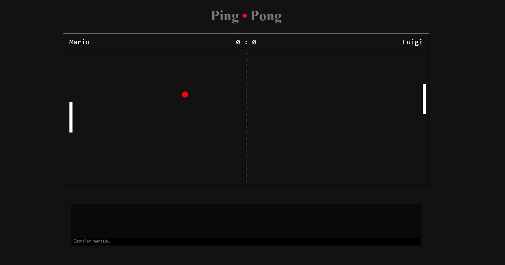

# Pong Realtime

**Pong Realtime** es un juego de Pong en tiempo real que utiliza WebSockets (mediante socket.io) para permitir que dos jugadores compitan en línea a través de sus navegadores. El proyecto demuestra comunicación bidireccional en tiempo real, modularización del código, interacción con el DOM y principios de lógica de juego, convirtiéndolo en una excelente muestra de habilidades para aprender y compartir.

## Características

- Juego clásico de Pong con acción en tiempo real.
- Comunicación bidireccional utilizando WebSockets mediante socket.io.
- Sincronización en vivo de la pelota, paletas y marcador.
- Interfaz minimalista y personalizable.
- Comandos de chat para modificar parámetros (por ejemplo, `/speed`, `/pause`, `/reset`), disponibles solo para el host.
- Gestión de salas y asignación de roles (host y rival) mediante socket.io.
- Código modularizado con separación de lógica de juego, UI y comunicación.

## Captura de Pantalla

Aquí tienes una captura del juego en acción:

## Contribuciones

¡Las contribuciones son bienvenidas! Si deseas mejorar el proyecto, sigue estos pasos:

1. Haz un fork del repositorio.
2. Crea una nueva rama (`git checkout -b feature/nueva-funcionalidad`).
3. Realiza tus cambios y haz commit (`git commit -am 'Añadir nueva funcionalidad'`).
4. Haz push a la rama (`git push origin feature/nueva-funcionalidad`).
5. Abre un Pull Request para que revisemos tus cambios.

## Licencia

Este proyecto está licenciado bajo la Licencia MIT - consulta el archivo [LICENSE](LICENSE) para más detalles.
